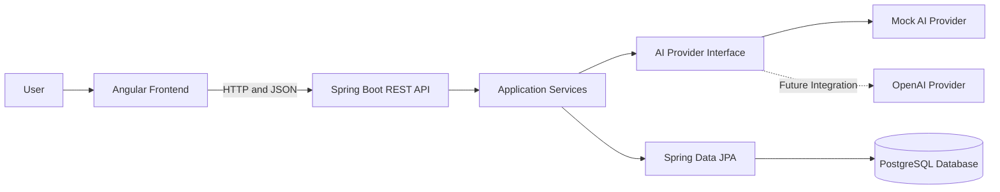
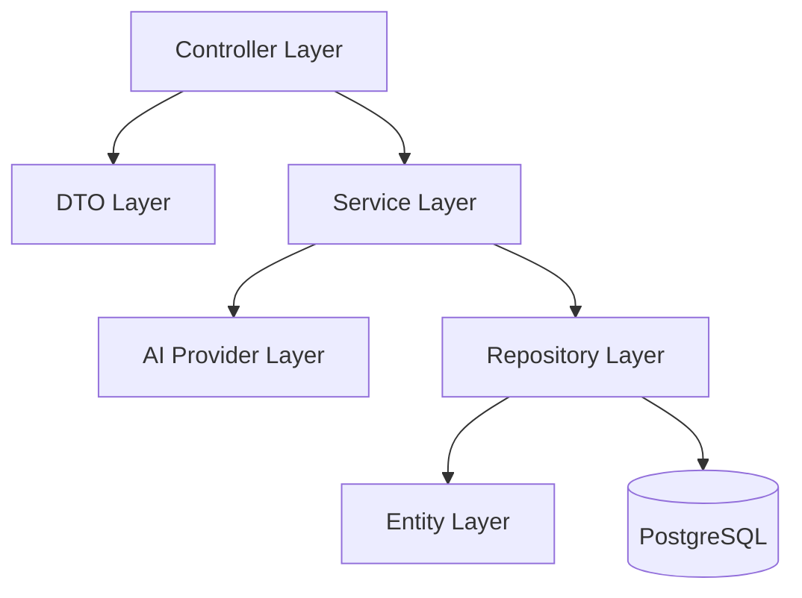
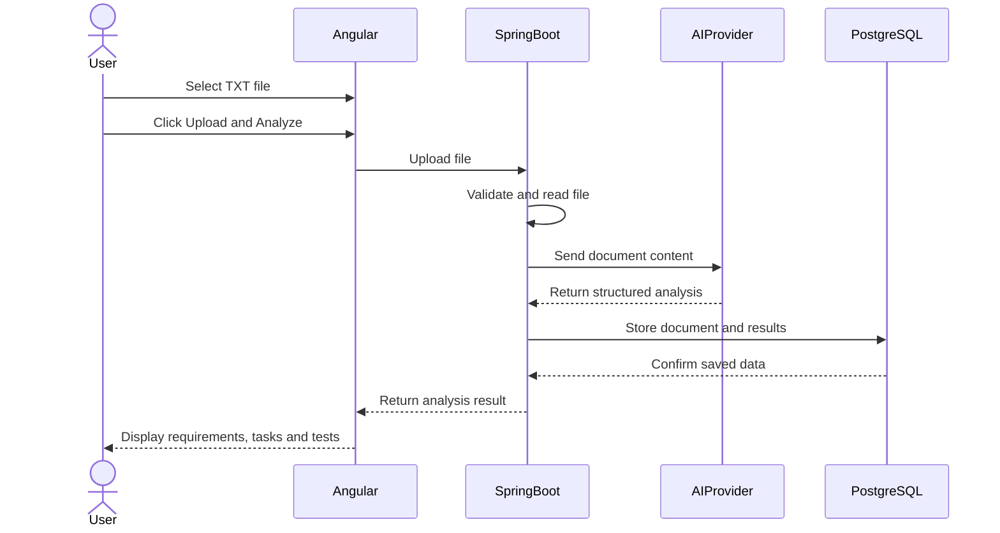

# ReqAI Project Architecture

## 1. Architecture Overview

ReqAI is a full-stack web application that transforms unstructured customer requirement documents into structured software development information.

The application follows a layered client-server architecture.

The main components are:

- Angular frontend
- Spring Boot REST API
- AI or Mock AI analysis provider
- PostgreSQL database

The frontend communicates with the backend using HTTP requests and JSON responses.

---

## 2. High-Level Architecture



### Architecture Flow

1. The user interacts with the Angular web application.
2. Angular sends HTTP requests to the Spring Boot backend.
3. Spring Boot validates and processes the request.
4. The uploaded requirement text is sent to the AI provider.
5. The AI provider returns structured analysis data.
6. Spring Boot stores the generated information in PostgreSQL.
7. The backend returns a JSON response to Angular.
8. Angular displays the analysis results to the user.

---

## 3. Frontend Architecture

The frontend is developed with Angular.

### Main Responsibilities

- Allow the user to select a TXT requirement document
- Validate the selected file
- Upload the file to the backend
- Start the analysis process
- Display loading and error states
- Display generated requirements
- Display development tasks
- Display test scenarios
- Display priority and complexity values
- Display previous analyses

### Planned Frontend Structure

```text
frontend/src/app/
├── core/
│   ├── models/
│   └── services/
├── features/
│   ├── document-upload/
│   ├── analysis-result/
│   └── analysis-history/
├── shared/
│   └── components/
├── app.routes.ts
└── app.config.ts
```

### Planned Pages

- Document Upload Page
- Analysis Result Page
- Analysis History Page

---

## 4. Backend Architecture

The backend is developed with Java and Spring Boot.

The backend follows a layered architecture.



### Controller Layer

The controller layer receives HTTP requests and returns HTTP responses.

Example responsibilities:

- Receive uploaded TXT files
- Start document analysis
- Return analysis history
- Return analysis details

### DTO Layer

DTOs define the request and response data exchanged between the frontend and backend.

DTOs prevent database entities from being exposed directly through the REST API.

### Service Layer

The service layer contains the main business logic.

Example responsibilities:

- Validate uploaded documents
- Read TXT file content
- Start AI analysis
- Convert AI responses into database entities
- Store generated results
- Retrieve previous analyses

### AI Provider Layer

The AI provider layer separates the analysis service from a specific AI implementation.

The first version will use a Mock AI provider.

A real AI provider may be added later without changing the main application workflow.

```text
AiProvider
├── MockAiProvider
└── OpenAiProvider (future)
```

### Repository Layer

The repository layer communicates with PostgreSQL through Spring Data JPA.

It is responsible for:

- Saving documents
- Saving requirements
- Saving development tasks
- Saving test scenarios
- Retrieving analysis history
- Retrieving analysis details

### Entity Layer

The entity layer represents the relational database tables.

The planned main entities are:

- AnalysisDocument
- BusinessRequirement
- DevelopmentTask
- TestScenario

---

## 5. Planned Backend Package Structure

```text
backend/src/main/java/com/company/reqai/
├── ai/
│   ├── dto/
│   ├── provider/
│   └── service/
├── config/
├── controller/
├── dto/
│   ├── request/
│   └── response/
├── entity/
├── exception/
├── repository/
├── service/
└── ReqaiApplication.java
```

### Package Responsibilities

| Package | Responsibility |
|---|---|
| `controller` | REST API endpoints |
| `dto` | Request and response data |
| `service` | Application business logic |
| `repository` | Database access |
| `entity` | JPA database entities |
| `ai` | Mock AI and future real AI integration |
| `exception` | Error handling |
| `config` | Application configuration |

This package structure is currently a design plan. The packages will be implemented during backend development.

---

## 6. Database Architecture

PostgreSQL will be used as the relational database.

The planned entity relationships are:

```text
AnalysisDocument
       1
       │
       N
BusinessRequirement
       1
       │
       N
DevelopmentTask
       1
       │
       N
TestScenario
```

Detailed table fields and relationships will be documented in `database-design.md`.

---

## 7. Document Analysis Workflow



---

## 8. Communication Formats

### File Upload

Requirement documents will be uploaded using:

```text
Content-Type: multipart/form-data
```

### API Responses

The backend will return structured responses using:

```text
Content-Type: application/json
```

Example:

```json
{
  "documentId": 1,
  "fileName": "customer-self-service-portal.txt",
  "status": "COMPLETED",
  "requirementCount": 7
}
```

---

## 9. Error Handling

Errors will be handled centrally by the Spring Boot backend.

Possible error situations include:

- Unsupported file type
- Empty document
- Document not found
- AI analysis failure
- Invalid AI response
- Database failure
- Unexpected server error

The backend will return meaningful HTTP status codes and error messages.

Example:

```json
{
  "status": 400,
  "message": "Only TXT files are supported."
}
```

---

## 10. Design Decisions

### Layered Architecture

A layered architecture separates API, business logic and database operations. This makes the project easier to understand, test and maintain.

### AI Provider Abstraction

The application will communicate with AI services through an `AiProvider` abstraction.

This allows the Mock AI implementation to be replaced by a real AI service in the future.

### Relational Database

PostgreSQL is suitable because the generated requirements, tasks and test scenarios have clear hierarchical relationships.

### Separate Frontend and Backend

Angular and Spring Boot are stored in separate folders and run as separate applications.

This keeps frontend and backend responsibilities independent.

---

## 11. Current Development Environment

| Component | Technology |
|---|---|
| Frontend | Angular |
| Backend | Spring Boot |
| Database | PostgreSQL |
| Database Access | Spring Data JPA |
| API Format | REST and JSON |
| File Format | TXT |
| AI Integration | Mock AI initially |
| Version Control | Git and GitHub |