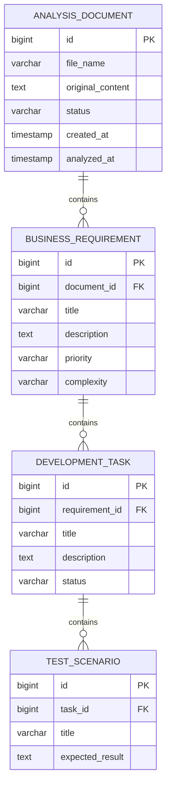

# ReqAI Database Design

## 1. Overview

ReqAI uses PostgreSQL to store uploaded requirement documents and the structured analysis results generated by the AI or Mock AI service.

The generated analysis has a hierarchical structure:

```text
Analysis Document
└── Business Requirements
    └── Development Tasks
        └── Test Scenarios
```

For the first version of the application, one uploaded document represents one analysis process.

If the analysis succeeds, the generated requirements, tasks and test scenarios are stored under the uploaded document.

---

## 2. Entity Relationship Diagram



---

## 3. Relationship Summary

```text
AnalysisDocument 1 ───── N BusinessRequirement

BusinessRequirement 1 ── N DevelopmentTask

DevelopmentTask 1 ────── N TestScenario
```

### Relationship Explanation

- One uploaded document can contain multiple business requirements.
- One business requirement can contain multiple development tasks.
- One development task can contain multiple test scenarios.
- Every business requirement belongs to exactly one uploaded document.
- Every development task belongs to exactly one business requirement.
- Every test scenario belongs to exactly one development task.

---

## 4. Analysis Document Table

### Table Name

```text
analysis_document
```

This table stores the original uploaded TXT document and the current state of its analysis.

| Column | PostgreSQL Type | Required | Description |
|---|---|---:|---|
| `id` | `BIGSERIAL` | Yes | Primary key |
| `file_name` | `VARCHAR(255)` | Yes | Original uploaded file name |
| `original_content` | `TEXT` | Yes | Complete text content of the uploaded document |
| `status` | `VARCHAR(30)` | Yes | Current analysis status |
| `created_at` | `TIMESTAMPTZ` | Yes | Date and time when the document was uploaded |
| `analyzed_at` | `TIMESTAMPTZ` | No | Date and time when the analysis was completed |

### Planned Java Entity

```text
AnalysisDocument
```

### Planned Status Values

```text
UPLOADED
PROCESSING
COMPLETED
FAILED
```

### Status Flow

```text
UPLOADED
    ↓
PROCESSING
   ↙   ↘
COMPLETED FAILED
```

---

## 5. Business Requirement Table

### Table Name

```text
business_requirement
```

This table stores the main business requirements generated from the uploaded document.

| Column | PostgreSQL Type | Required | Description |
|---|---|---:|---|
| `id` | `BIGSERIAL` | Yes | Primary key |
| `document_id` | `BIGINT` | Yes | Foreign key referencing `analysis_document.id` |
| `title` | `VARCHAR(255)` | Yes | Requirement title |
| `description` | `TEXT` | Yes | Detailed requirement description |
| `priority` | `VARCHAR(20)` | Yes | Requirement priority |
| `complexity` | `VARCHAR(20)` | Yes | Estimated requirement complexity |

### Planned Java Entity

```text
BusinessRequirement
```

### Planned Priority Values

```text
LOW
MEDIUM
HIGH
```

### Planned Complexity Values

```text
LOW
MEDIUM
HIGH
```

### Foreign Key

```text
business_requirement.document_id
    → analysis_document.id
```

---

## 6. Development Task Table

### Table Name

```text
development_task
```

This table stores development-ready tasks generated for each business requirement.

| Column | PostgreSQL Type | Required | Description |
|---|---|---:|---|
| `id` | `BIGSERIAL` | Yes | Primary key |
| `requirement_id` | `BIGINT` | Yes | Foreign key referencing `business_requirement.id` |
| `title` | `VARCHAR(255)` | Yes | Task title |
| `description` | `TEXT` | Yes | Detailed task description |
| `status` | `VARCHAR(30)` | Yes | Current task status |

### Planned Java Entity

```text
DevelopmentTask
```

### Planned Task Status Values

```text
NEW
IN_PROGRESS
COMPLETED
```

The Mock AI service initially generates tasks with the status:

```text
NEW
```

### Foreign Key

```text
development_task.requirement_id
    → business_requirement.id
```

---

## 7. Test Scenario Table

### Table Name

```text
test_scenario
```

This table stores the test scenarios generated for each development task.

| Column | PostgreSQL Type | Required | Description |
|---|---|---:|---|
| `id` | `BIGSERIAL` | Yes | Primary key |
| `task_id` | `BIGINT` | Yes | Foreign key referencing `development_task.id` |
| `title` | `VARCHAR(255)` | Yes | Test scenario title |
| `expected_result` | `TEXT` | Yes | Expected result of the test scenario |

### Planned Java Entity

```text
TestScenario
```

### Foreign Key

```text
test_scenario.task_id
    → development_task.id
```

---

## 8. Example Stored Data

A simplified example of the stored hierarchy is shown below.

```text
AnalysisDocument
├── fileName: customer-self-service-portal.txt
├── status: COMPLETED
└── BusinessRequirement
    ├── title: User Login
    ├── priority: HIGH
    ├── complexity: MEDIUM
    └── DevelopmentTask
        ├── title: Develop Login API
        ├── status: NEW
        └── TestScenario
            ├── title: Successful login
            └── expectedResult: User should log in with valid credentials.
```

---

## 9. Cascade Behavior

The entity relationships will use cascade operations.

When an analysis document is deleted:

1. Its business requirements should be deleted.
2. The related development tasks should be deleted.
3. The related test scenarios should be deleted.

Expected delete behavior:

```text
Delete AnalysisDocument
        ↓
Delete BusinessRequirements
        ↓
Delete DevelopmentTasks
        ↓
Delete TestScenarios
```

This prevents orphan records from remaining in the database.

---

## 10. Database Constraints

The following constraints are planned:

### Analysis Document

- `file_name` cannot be null.
- `original_content` cannot be null.
- `status` cannot be null.
- `created_at` cannot be null.

### Business Requirement

- `document_id` cannot be null.
- `title` cannot be null.
- `priority` cannot be null.
- `complexity` cannot be null.

### Development Task

- `requirement_id` cannot be null.
- `title` cannot be null.
- `status` cannot be null.

### Test Scenario

- `task_id` cannot be null.
- `title` cannot be null.
- `expected_result` cannot be null.

Foreign key constraints will prevent child records from referencing nonexistent parent records.

---

## 11. Planned Indexes

PostgreSQL automatically creates indexes for primary keys.

Additional indexes may be created for frequently used foreign keys:

```text
business_requirement.document_id
development_task.requirement_id
test_scenario.task_id
```

An index may also be added for analysis history queries:

```text
analysis_document.created_at
analysis_document.status
```

These indexes will make analysis history and detail queries more efficient.

---

## 12. Design Decisions

### Store Original Document Content

The uploaded TXT content will be stored in the database.

This allows the application to:

- Display the original input later
- Re-run analysis in a future version
- Compare input and generated output
- Keep a complete analysis history

### Use Separate Tables

Requirements, tasks and test scenarios are stored in separate relational tables instead of one JSON column.

This provides:

- Clear relationships
- Easier querying
- Better database integrity
- Easier frontend navigation
- Easier future editing and filtering

### One Upload Represents One Analysis

For the first version, each uploaded document has one analysis result.

A future version may introduce a separate `analysis_run` table to support multiple analysis versions for the same document.

### Store Enum Values as Strings

Status, priority and complexity values will be stored as readable strings.

Example:

```text
HIGH
MEDIUM
COMPLETED
```

This is safer and easier to understand than storing enum positions as numbers.

---

## 13. Planned JPA Relationships

The planned Java entity relationships are:

```text
AnalysisDocument
@OneToMany
List<BusinessRequirement>
```

```text
BusinessRequirement
@ManyToOne
AnalysisDocument

@OneToMany
List<DevelopmentTask>
```

```text
DevelopmentTask
@ManyToOne
BusinessRequirement

@OneToMany
List<TestScenario>
```

```text
TestScenario
@ManyToOne
DevelopmentTask
```

The actual entity classes will be implemented during Week 2 backend development.